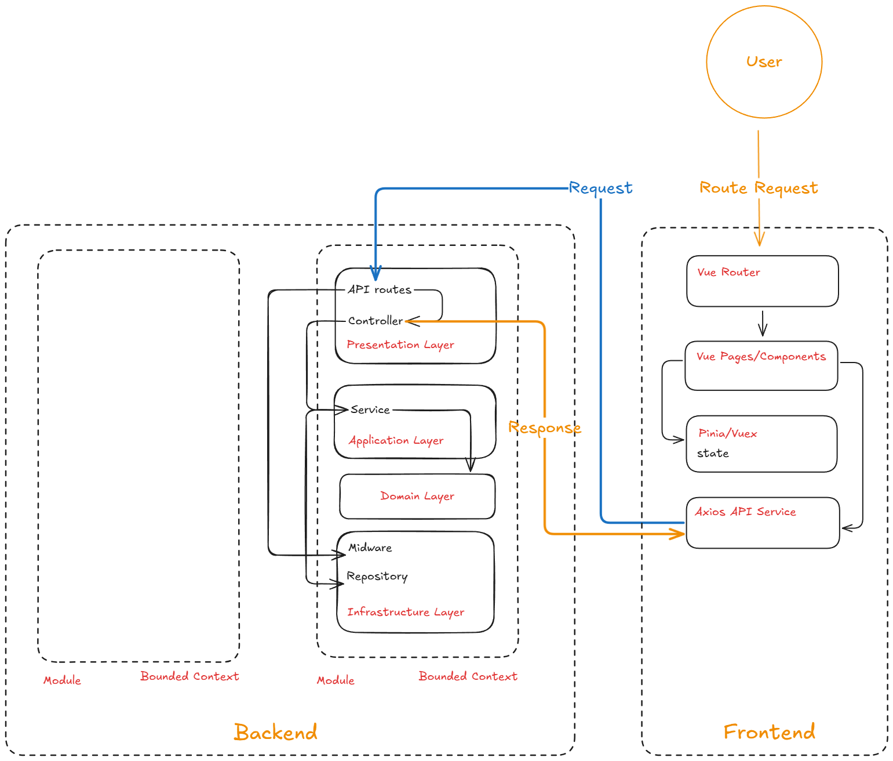

# Coffee Shop Application

A full-stack web application for managing a coffee shop, built with Vue.js frontend and Node.js/Express backend.

## System architecture



## System Requirements

- Node.js 16.x or higher
- MongoDB 4.4 or higher
- npm or yarn
- Docker and Docker Compose (recommended)

## Project Structure

```
coffee-shop-app/
├── coffee-shop-frontend/  # Vue.js frontend
└── coffee-shop-backend/   # Node.js/Express backend
```

## Installation & Setup

### Option 1: Using Docker (Recommended)

1. Clone the repository:
```bash
git clone https://github.com/nplongx/coffee-shop-app.git
cd coffee-shop-app
```

2. Create environment files:
```bash
# Frontend
cp coffee-shop-frontend/.env.example coffee-shop-frontend/.env

# Backend
cp coffee-shop-backend/.env.example coffee-shop-backend/.env
```

3. Create netword:
```bash
docker network create coffee-shope-network
```

4. Locate the `mongodb.conf` (in docker files) file and add the replica set details

Add the following replica set details to `mongodb.conf` file

```bash
replication:
  replSetName: "r0"
```

Initiate the replica set using `rs.initiate()`
```bash
docker exec -it <container_name_of_mongodb> mongo
rs.initiate()
```
Reference: https://stackoverflow.com/questions/59571945/the-changestream-stage-is-only-supported-on-replica-sets-error-while-using-mo

5. Start the application using Docker Compose:
```bash
cd coffee-shop-frontend
docker-compose up -d

cd coffee-shop-backend
yarn docker:dev -d
```

The application will be available at:
- Frontend: http://localhost:5173
- Backend API: http://localhost:3000
- API Documentation: http://localhost:3000/v1/docs

### Option 2: Standard Installation

1. Clone the repository:
```bash
git clone https://github.com/nplongx/coffee-shop-app.git
cd coffee-shop-app
```

2. Setup Frontend:
```bash
cd coffee-shop-frontend
npm install
cp .env.example .env.development
npm run dev
```

3. Setup Backend:
```bash
cd ../coffee-shop-backend
npm install
cp .env.example .env
npm run dev
```

4. Access the application:
- Frontend: http://localhost:5173
- Backend API: http://localhost:3000
- API Documentation: http://localhost:3000/v1/docs

## Environment Variables

### Frontend (.env.development)
```
VITE_API_URL=http://localhost:3000/v1
VITE_CLERK_PUBLISHABLE_KEY=your-clerk-publishable-key
```

### Backend (.env)
```
# Port number
PORT=3000

# URL of the Mongo DB
MONGODB_URL=mongodb://127.0.0.1:27017/coffee-shop

# JWT
# JWT secret key
JWT_SECRET=thisisasamplesecret
# Number of minutes after which an access token expires
JWT_ACCESS_EXPIRATION_MINUTES=30
# Number of days after which a refresh token expires
JWT_REFRESH_EXPIRATION_DAYS=30
# Number of minutes after which a reset password token expires
JWT_RESET_PASSWORD_EXPIRATION_MINUTES=10
# Number of minutes after which a verify email token expires
JWT_VERIFY_EMAIL_EXPIRATION_MINUTES=10

# SMTP configuration options for the email service
# For testing, you can use a fake SMTP service like Ethereal: https://ethereal.email/create
SMTP_HOST=email-server
SMTP_PORT=587
SMTP_USERNAME=email-server-username
SMTP_PASSWORD=email-server-password
EMAIL_FROM=support@yourapp.com

# Clerk API keys
CLERK_PUBLISHABLE_KEY=your-clerk-publishable-key
CLERK_SECRET_KEY=your-clerk-secret-key
```

## Testing

### Backend Tests

### Frontend Tests

## API Documentation

The API documentation is available at `/v1/docs` when the backend server is running. It provides detailed information about all available endpoints and their usage.
